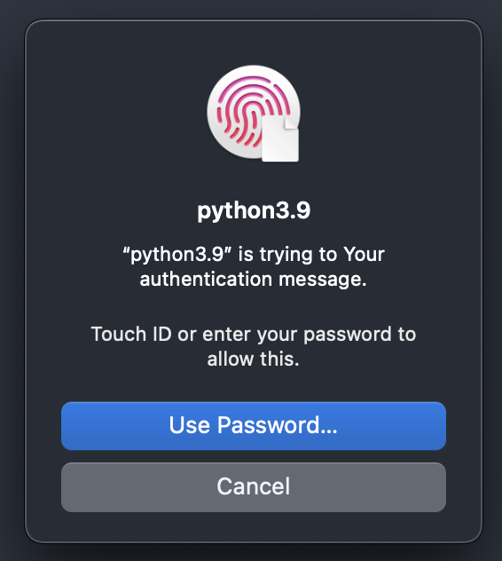

# Keying

A simple python wrapper around the LocalAuthentication and Keychain APIs on iOS/MacOS.

[](https://swift.org/download/)
[](https://opensource.org/licenses/Apache-2.0)
[](https://github.com/WebOfTrust/keying/actions/workflows/ci.yaml)
[](https://codecov.io/gh/weboftrust/keying)

Compilation:

```shell
swift build
```

This produces a libkeying.dylib.

#### Note
The current python module implementation relies on the packaged lib being local.

Other options would be to move things globally (and update the module):

```shell
cp mv libkeying.dylib /usr/lib64/python3.9/lib-dynload
cp keying.py /usr/local/lib/python3.9/site-packages
```

#### Sample local usage

```shell
❯ swift build
❯ python
Python 3.9.7 (default, Jan 27 2022, 19:47:28)
[Clang 13.0.0 (clang-1300.0.29.30)] on darwin
Type "help", "copyright", "credits" or "license" for more information.
>>> import keying
>>> keying.auth("Your authentication message")
True
>>>
```

